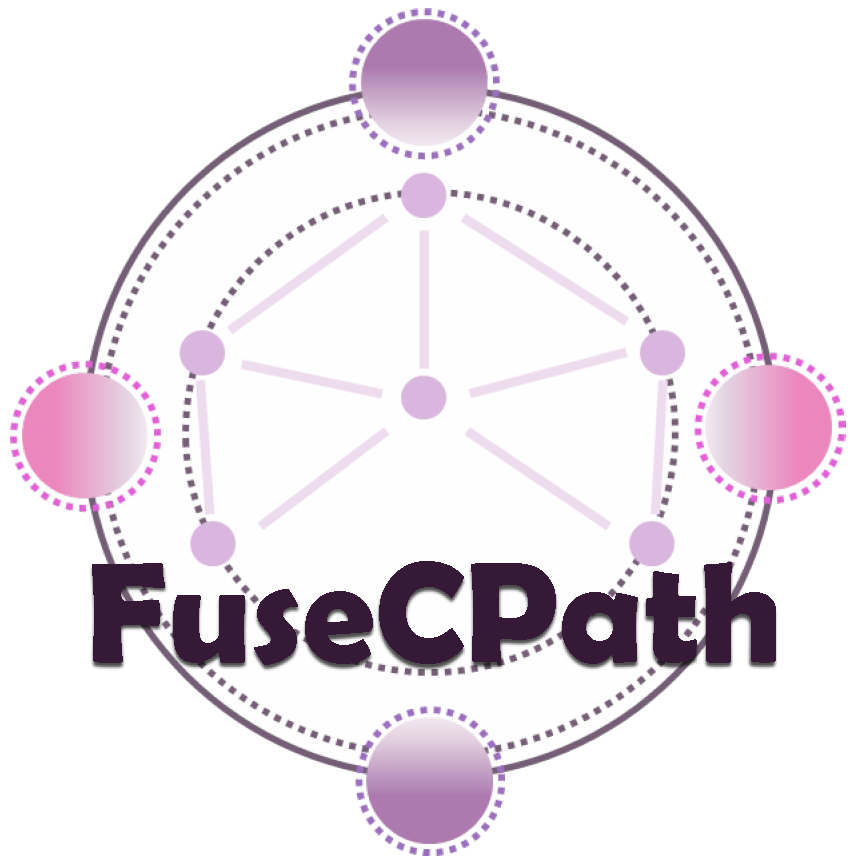

# FuseCPath
Official implementation of the paper: Fusion of Heterogeneous Pathology Foundation Models for Whole Slide Image Analysis. <b>Complete code will be released upon paper accepatance.</b>

## Introduction

Pathological FMs have exhibited substantial heterogeneity caused by diverse private training datasets and different network architectures. This heterogeneity introduces performance variability when we utilize the extracted features from different FMs in the downstream tasks. To fully explore the advantage of multiple FMs effectively, in this work, we propose a novel framework for the fusion of heterogeneous pathological FMs, called FuseCPath, yielding a model with a superior ensemble performance by introducing patch-level local features re-embedding and slide-level collaborative distillation. Extensive experiments conducted on cancer datasets from The Cancer Genome Atlas (TCGA) have demonstrated that the proposed FuseCPath achieves state-of-the-art performance across multiple tasks on these public datasets.

## System requirement
Ubuntu 20.04, CUDA version 12.0. <br>

## Dataset
Whole slide image (WSI) and gene expression dataset: The WSIs and paired gene expression data used in this work are from TCGA (https://portal.gdc.cancer.gov/), open access to all.

## Major packages
```
python==3.10
torch==2.6.0
torchvision==0.21.0
huggingface-hub==0.30.2
openslide-python==1.4.2
trident
mvlearn
```

## Usage
Complete usage will be released upon paper accepatance.
```
python train.py --wsi_train_feat_dir './training_emds' \
 --model_output_path './results' \
 --wsi_valid_feat_dir './validation_emds' \
 --label_path './labels' \
 --teacher_emds_path_1 './teacher_1_emds' \
 --teacher_emds_path_2 './teacher_2_emds' \
 --teacher_emds_path_3 './teacher_3_emds' \
 --num_classes 2 \
 --epochs 60 \
 --batch-size 64 \
 --lr 0.0001 \
 --seed 2025
```

## Acknowledgement
We sinceresly thank following work with their open-sourced code.<br>
Wentao,Tang et al. Feature Re-Embedding: Towards Foundation Model-Level Performance in Computational Pathology. CVPR 2024. https://doi.ieeecomputersociety.org/10.1109/CVPR52733.2024.01078  <br>
Andrew Z et al. Accelerating Data Processing and Benchmarking of AI Models for Pathology. arXiv 2025. https://arxiv.org/pdf/2502.06750  <br>

## Citation
